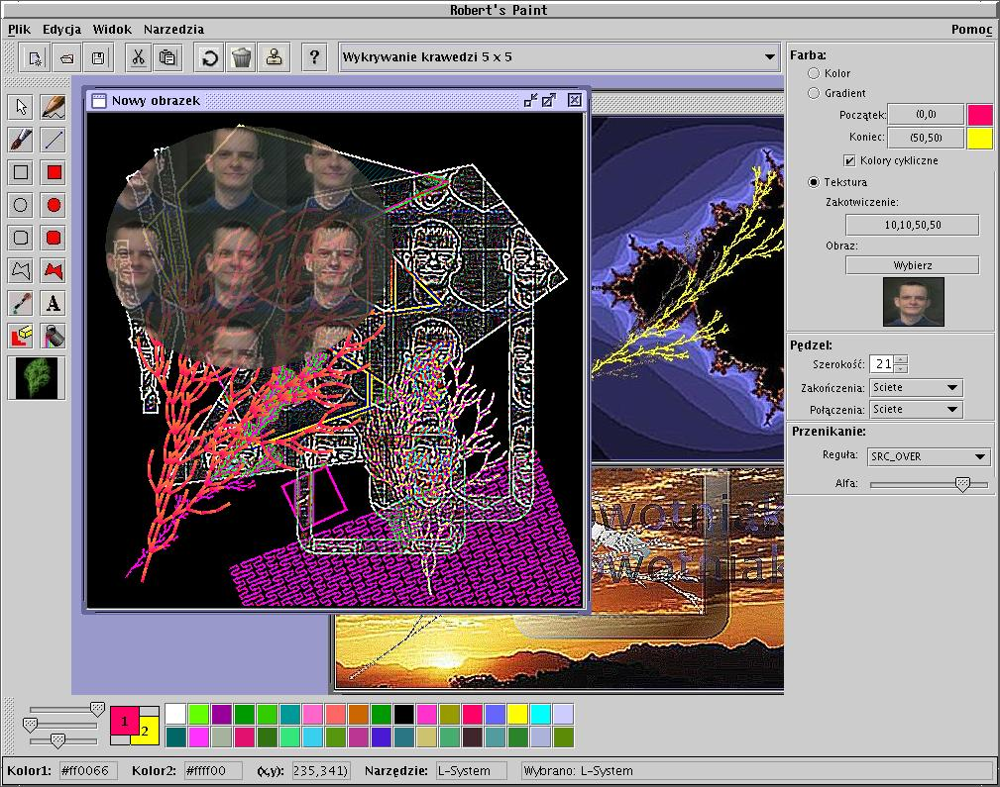

# Robert's Paint 

Author: Robert Nowotniak, 2005 <<robert@nowotniak.com>>

To run this program, compile it with javac, and run:

```bash
$ java RobPaint
```


Drawing tools implemented in Java:

* Brush
* Bucket
* ColorPicker
* EllipseDrawer
* Eraser
* FilledEllipseDrawer
* FilledPolygonDrawer
* FilledRectangleDrawer
* FilledRoundRectangleDrawer
* ImageProcessor
* LineDrawer
* LSystemDrawer
* ModifiableShape
* Pencil
* PolygonDrawer
* RectangleDrawer
* RoundRectangleDrawer
* ShapeModifier
* TextInsert

